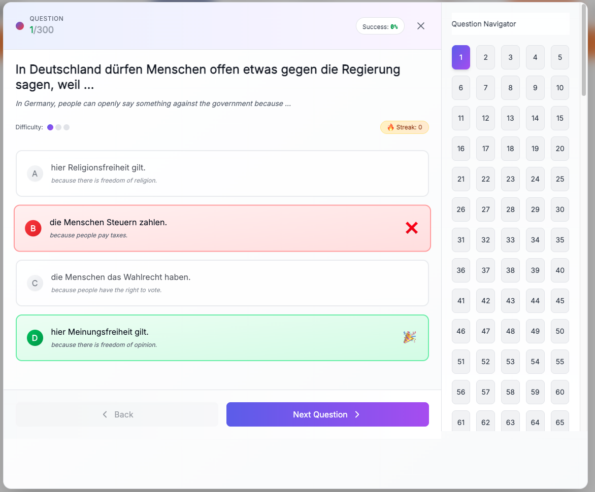

# 🇩🇪 LebiDE — Leben in Deutschland Test Trainer


LebiDE is an interactive learning platform for preparing the **Leben in Deutschland** and **Einbürgerungstest** exams. It delivers the complete official question catalog (460 questions) with multilingual support, smart quiz flows, and a Firebase-powered backend.

🌐 Built with **React (Create React App), TailwindCSS, Framer Motion, Firebase, and EmailJS**.

---

## 🚀 Features

- ✅ Full official **460-question catalog** (300 general + 160 Bundesland-specific)
- 🌍 Multilingual questions (German 🇩🇪, English 🇬🇧, Bengali 🇧🇩)
- 🧠 Smart quiz modes: learning, mixed exam simulation, wrong answer reviews, unanswered filters
- 🔐 Firebase Authentication with Google, Facebook, Microsoft, GitHub, email/password, and anonymous providers
- 📊 Progress tracking persisted in Realtime Database + localStorage helpers
- 💬 Feedback system backed by Firestore with emoji reactions and admin moderation helpers
- 📩 Contact form using EmailJS + Google reCAPTCHA for spam protection
- 📱 Fully responsive mobile-first UI
- ⚡ Fast SPA experience deployed via Firebase Hosting

---

## 📸 Screenshots

### Home Page


### Quiz Interface



### Mixed Test Mode


### Wrong Answers Review


---

## 🧱 Tech Stack

| Layer            | Technology                  |
| ---------------- | --------------------------- |
| Frontend         | React (Create React App)    |
| UI               | TailwindCSS + Framer Motion |
| Authentication   | Firebase Authentication     |
| Realtime Sync    | Firebase Realtime Database  |
| Feedback Storage | Firebase Firestore          |
| Forms            | EmailJS                     |
| Spam Protection  | Google reCAPTCHA            |
| Hosting          | Firebase Hosting            |

---

## 🧭 Architecture & Flow

- **Frontend:** CRA entry point (`src/index.js`) renders `App.js`, which orchestrates the phase-based UI (home, quiz, contact, feedback, wrong answers).
- **Component module:** `src/components/index.js` exports shared UI widgets (`AuthForm`, `ContactForm`, `FeedbackForm`, `LoginModal`, `ShareCard`, `WrongList`, `Footer`, `LanguageSelector`).
- **Quiz features:** `features/quiz` houses `LebenInDeutschland.js`, `MixedTest.js`, and `UnansweredQuestions.js`, handling question flow, answer tracking, and review states.
- **Data:** Static JSON question files live under `public/` (per Bundesland or general) and are fetched at runtime.
- **Services:** `src/services/firebase.js` bootstraps Firebase apps/providers; `src/services/authHandlers.js` centralizes login flows and `onAuthStateChanged` handling.
- **Utils:** `src/utils/wrongAnswers.js` and localStorage helpers manage persisted state such as wrong answers and quiz history.
- **Backend:** Firebase (Auth, Realtime Database, Firestore) synchronizes user progress, feedback, and contact submissions. EmailJS + reCAPTCHA powers the contact workflow.

---

## 📂 Project Structure

```
src/
  App.js                       # Phase-based routing + UI shell
  index.js                     # React entry
  index.css                    # Tailwind + global styles

  pages/
    HomeSelect.js              # Landing, navigation, and quiz launcher

  features/
    quiz/
      LebenInDeutschland.js    # Quiz engine + UI
      MixedTest.js             # Mixed test logic
      UnansweredQuestions.js   # Unanswered question review

  components/
    index.js                   # Shared components exported together

  data/
    bundeslaender.js           # Bundesland metadata
    languages.js               # Language configuration

  services/
    firebase.js                # Firebase init + providers
    authHandlers.js            # Auth helper flows

  utils/
    wrongAnswers.js            # LocalStorage helpers (wrong answers, quizzes)

public/
  questions/                   # General question JSON files
  bundesland/                 # Bundesland-specific JSON files
  assets/                      # Icons, PDFs, static media
```

---

## ⚙️ Installation

Clone the repository:

```bash
git clone https://github.com/somdrabb/LebenInDeutschlandTest.git
cd LebenInDeutschlandTest
```

Install dependencies:

```bash
npm install
```

Start development server:

```bash
npm start
```

Build production bundle:

```bash
npm run build
```

Deploy-ready build (runs build + Firebase deploy):

```bash
npm run build-deploy
```

---

## 🔑 Environment Variables

Create a `.env` file with the Firebase, EmailJS, and reCAPTCHA keys listed below. Do **not** commit `.env`.

```
REACT_APP_FIREBASE_API_KEY=
REACT_APP_FIREBASE_AUTH_DOMAIN=
REACT_APP_FIREBASE_PROJECT_ID=

REACT_APP_EMAILJS_SERVICE_ID=
REACT_APP_EMAILJS_TEMPLATE_CONTACT=
REACT_APP_EMAILJS_TEMPLATE_REPLY=
REACT_APP_EMAILJS_PUBLIC_KEY=

REACT_APP_RECAPTCHA_SITE_KEY=
```

See `.env.example` for full context.

---

## 🔥 Firebase Hosting

Login to Firebase:

```bash
firebase login
```

Deploy the SPA:

```bash
npm run build
firebase deploy
```

The `firebase.json` config rewrites all routes to `build/index.html` so the client handles routing.

---

## 📊 Quiz Data

The project bundles the **complete official question dataset**.

| Category             | Questions |
| -------------------- | --------- |
| General questions    | 300       |
| Bundesland questions | 160       |
| **Total**            | **460**   |

JSON files live under `public/` and `public/bundesland/` and are loaded via fetch in the quiz components.

---

## 🔐 Authentication Flow

1. User opens the login modal.
2. Firebase provider login executes via `authHandlers.js`.
3. `onAuthStateChanged` in `App.js` updates the UI and persists session state.

Supported providers: Google, Facebook, Microsoft, GitHub, email/password, anonymous.

---

## 💾 Local Storage Keys

| Key                  | Purpose                         |
| -------------------- | ------------------------------- |
| `wrongAnswers`       | Tracks incorrect questions      |
| `quiz_history`       | Captures quiz attempts          |
| `mixed_test_results` | Stores exam simulation outcomes |
| `selectedBundesland` | Records the active Bundesland   |
| `lebide_ui_state`    | UI state cache                  |

---

## 🛠 Scripts

```
npm start
npm run build
npm run build-deploy
```

---

## 🤝 Contributing

Contributions welcome!

1. Fork the repository.
2. Create a feature branch.
3. Submit a Pull Request.

Please include changelog notes for any architectural updates.

---

## 🌐 Live Demo

🚀 [https://lebide.web.app](https://lebide.web.app)

---

## 📊 Project Stats

- Total Questions: **460**
- Bundesländer Covered: **16**
- Languages Supported: **3**
- Quiz Modes: **4**
- Authentication Providers: **6**

---

## 🧠 Quiz Modes

| Mode          | Description                       |
| ------------- | --------------------------------- |
| Learning Mode | Practice questions by topic       |
| Mixed Test    | Simulates the real exam           |
| Wrong Answers | Review mistakes and explanations  |
| Unanswered    | Continue unfinished question sets |

---

## 📚 Documentation

- [Architecture](docs/ARCHITECTURE.md)
- [Datasets](docs/DATASETS.md)
- [Security](docs/SECURITY.md)
- [Changelog](CHANGELOG.md)

---

## 📜 License

MIT License

---

## 👨‍💻 Author

Created by **Somdrabb** | Project: **LebiDE — Kompetenz für Integration**
