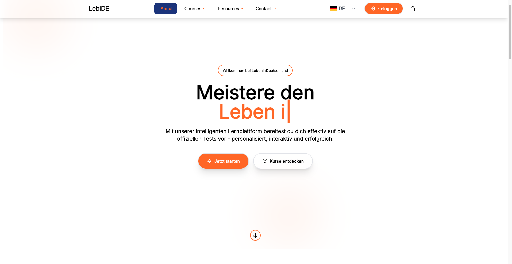
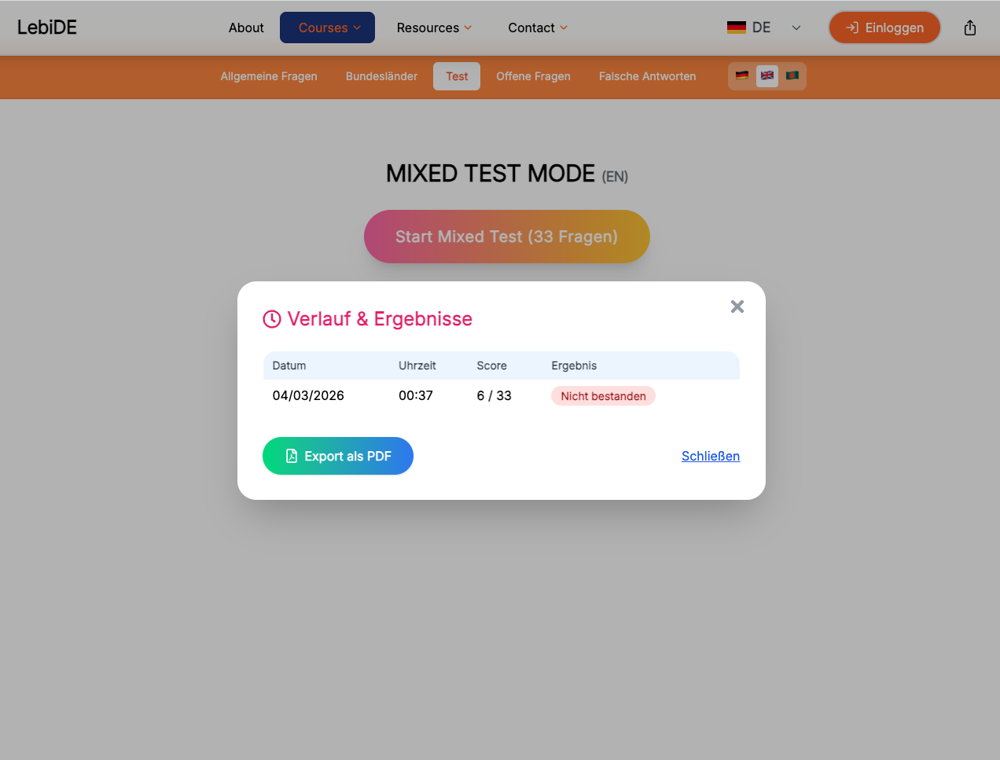
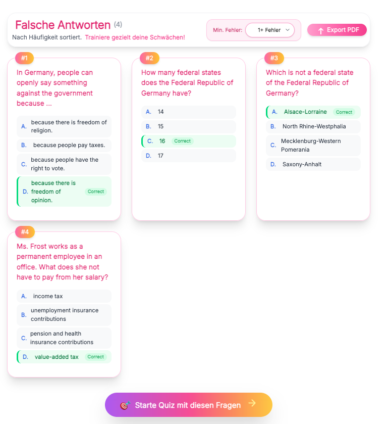

# 🇩🇪 LebiDE — Leben in Deutschland Test Trainer

    

Interactive learning platform to prepare for the official German citizenship tests:

- Leben in Deutschland
- Einbürgerungstest

Practice all 300 official BAMF questions, train weak areas, and simulate the real exam using smart quiz modes, Firebase persistence, and a modern UI built with React, TailwindCSS, and Framer Motion.

🚀 Live Demo

https://lebide.web.app

---

## ✨ Features

### 📚 Question System

- All 300 official questions
- Bundesland-specific questions
- Mixed exam simulation (33 questions)
- Open questions trainer

### 🧠 Smart Learning

- Wrong answers trainer
- Exam history & statistics
- PDF export of results

### 🌍 Multi-language Support

- German
- English
- Bengali

### 🔐 Authentication

Firebase Authentication with:

- Google
- GitHub
- Microsoft
- Facebook
- Email
- Anonymous

### ☁️ Cloud Persistence

- Firebase Realtime Database
- Firebase Firestore

### 🎨 Modern UI

- TailwindCSS
- Framer Motion animations
- Fully responsive layout

---

## 🖼 Screenshots

### Homepage



### Quiz Mode


### Mixed Test



### Wrong Answers Trainer



---

## 🧠 Learning Modes

| Mode              | Description                            |
| ----------------- | -------------------------------------- |
| General Questions | Practice the official 300 questions    |
| Bundesland Mode   | State-specific questions               |
| Mixed Test        | Simulates the real exam (33 questions) |
| Wrong Answers     | Train the questions you answered wrong |
| Open Questions    | Practice unanswered questions          |

---

## 🏗 Tech Stack

**Frontend**

- React (Create React App)
- TailwindCSS
- Framer Motion

**Backend Services**

- Firebase Authentication
- Firebase Realtime Database
- Firebase Firestore

**Hosting**

- Firebase Hosting

---

## 📁 Project Structure

```
src/
├── components
├── features
│   └── quiz
├── pages
├── services
├── utils
└── data

public/
├── bundesland
├── assets
└── questions.json
```

---

## ⚙️ Installation

```bash
git clone https://github.com/somdrabb/LebenInDeutschlandTest.git
npm install
npm start
```

Build production bundle:

```bash
npm run build
```

---

## 🔐 Environment Variables

Create `.env` with your credentials. Never commit `.env`.

```
REACT_APP_FIREBASE_API_KEY=
REACT_APP_FIREBASE_AUTH_DOMAIN=
REACT_APP_FIREBASE_PROJECT_ID=

REACT_APP_EMAILJS_SERVICE_ID=
REACT_APP_EMAILJS_TEMPLATE_ID=
REACT_APP_EMAILJS_PUBLIC_KEY=

REACT_APP_RECAPTCHA_SITE_KEY=
```

---

## 🚀 Deployment

```bash
npm run build-deploy
```

Deploys the SPA to Firebase Hosting.

---

## 🧭 Roadmap

- Progressive Web App (PWA)
- AI explanations for questions
- Spaced repetition learning system
- Leaderboards
- Advanced analytics
- Mobile application

For detailed implementation ideas see `docs/PRODUCT_UPGRADES.md`.

---

## 📚 Docs

- [Architecture](docs/ARCHITECTURE.md)
- [Datasets](docs/DATASETS.md)
- [Security](docs/SECURITY.md)
- [Product upgrades](docs/PRODUCT_UPGRADES.md)
- [Changelog](CHANGELOG.md)

---

## 🤝 Contributing

Contributions are welcome—see [CONTRIBUTING.md](CONTRIBUTING.md) for the workflow.

---

## 🔒 Security

Please report vulnerabilities privately and avoid committing secrets (Firebase keys, OAuth secrets, EmailJS private keys, `.env` files). See [docs/SECURITY.md](docs/SECURITY.md) for details.

---

## 📜 License

MIT License

---

## 👨‍💻 Author

Somdrabb | LebiDE — Kompetenz für Integration
